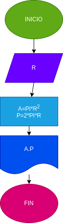

# Ejercicio No.1
## calcular el aarea y el perimetro del circulo r

# ANALISIS 

variable de entrada (imput)

R:Radio del circulo

variable del proceso y salida (processing, storang, outout)

A:Area del circulo
P:Perimetro del circulo
# DISEÑO

# CONSTRUCCION